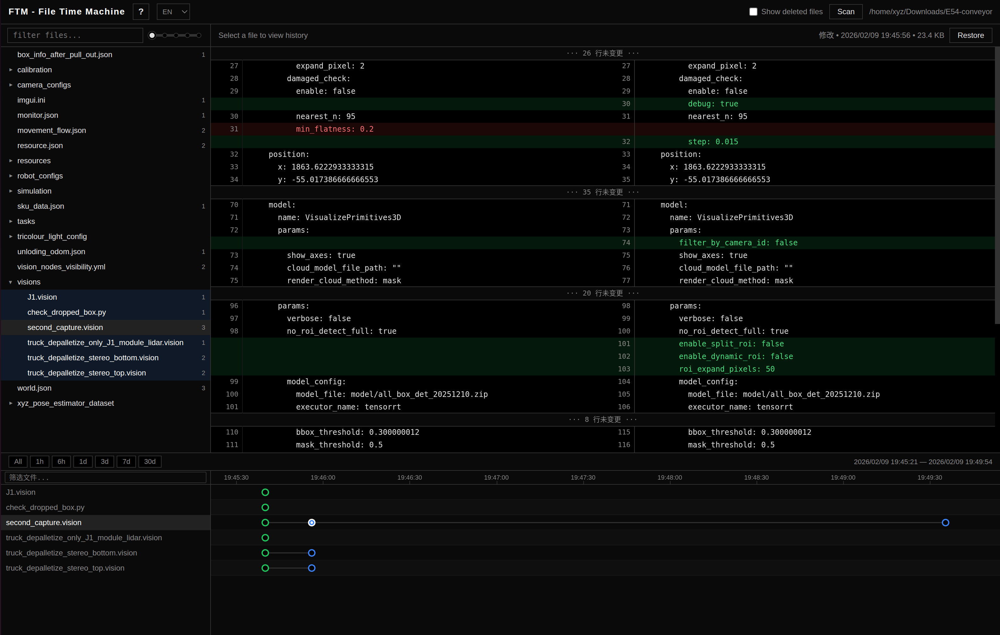

# FTM — File Time Machine

**Automatic version tracking for your text files.** Monitor changes in real time, create snapshots silently in the background, and browse full history with a built-in Web UI — all from a single binary with zero external dependencies.



---

## Highlights

- **Real-time file watching** — powered by OS-native events (`notify` crate), changes are captured the instant they happen.
- **Content-addressable snapshots** — files are stored by SHA-256 hash, so identical content is never duplicated.
- **Built-in Web UI** — file tree, side-by-side diff viewer, and a visual timeline — no extra install required.
- **Glob pattern filtering** — fine-grained control over which files to track and which to ignore.
- **One-click restore** — roll any file back to a previous version from the CLI or Web UI.
- **Periodic scanning** — automatically detects changes that happened while FTM was not running.
- **Multi-language UI** — English and Chinese out of the box.
- **Single binary** — frontend assets are embedded at compile time; just copy and run.
- **Cross-platform** — Linux, macOS, and Windows.

---

## Quick Start

```bash
# Build and install
cargo install --path .

# Start watching the current directory
ftm checkout .

# Edit some files, then check history
ftm history src/main.rs

# Open the Web UI
# (automatically available at http://localhost:13580 after checkout)
```

---

## Installation

### Prerequisites

- [Rust toolchain](https://rustup.rs/) (stable, 1.75+)

### From source

```bash
git clone https://github.com/user/ftm.git
cd ftm
cargo build --release

# Binary is at target/release/ftm
```

### Via cargo install

```bash
cargo install --path .
# Installs `ftm` to ~/.cargo/bin/
```

> **Note:** The Web UI frontend is embedded into the binary at compile time via `rust-embed`. No separate build step or Node.js runtime is needed.

---

## CLI Usage

FTM follows a client-server architecture. Running `ftm checkout` automatically starts a background server; all other commands communicate with it over HTTP.

### Commands

| Command | Description |
|---------|-------------|
| `ftm checkout <dir>` | Initialize `.ftm/` in a directory and begin watching |
| `ftm ls` | List tracked files (use `--include-deleted` to include deleted) |
| `ftm history <file>` | Show version history for a file |
| `ftm restore <file> <checksum>` | Restore a file to a specific version |
| `ftm scan` | Trigger a full manual scan |
| `ftm clean` | Remove snapshot files not referenced by any history entry, free disk space |
| `ftm config get [key]` | Show configuration (all or by key) |
| `ftm config set <key> <value>` | Update a configuration value |
| `ftm stats` | Show history and quota usage (current / max) |
| `ftm version` | Print client and server version |
| `ftm logs` | View server log files |
| `ftm stop` | Gracefully stop the background server |

### Global Options

| Option | Default | Description |
|--------|---------|-------------|
| `--port <port>` | `13580` | HTTP port used by the server and all client commands |

### Examples

```bash
# Watch a project directory (absolute or relative path)
ftm checkout /home/user/my-project

# List tracked files (include deleted ones)
ftm ls --include-deleted

# View history of a specific file
ftm history config/settings.yaml

# Restore a file (checksum prefix, at least 8 chars)
ftm restore config/settings.yaml a3f8e2b1

# Check history and quota usage
ftm stats

# Change max history versions per file
ftm config set settings.max_history 200

# Adjust scan interval (seconds)
ftm config set settings.scan_interval 60
```

---

## Web UI

Once `ftm checkout` is running, open **http://localhost:13580** in your browser.

### Toolbar

- **History / Quota** — Progress bars show current history count and snapshot storage usage against `max_history` and `max_quota`. Displayed next to the language switcher when a directory is checked out.
- **Language** — Switch between English and Chinese.
- **Show deleted files** — Toggle whether deleted files appear in the file list.
- **Scan** — Trigger a full manual scan.

### File Tree (Left Panel)

- Browse all tracked files in a collapsible tree view.
- **Glob filter** — type patterns like `*.rs` or `src/**` to narrow down the file list.
- **Tree depth slider** — quickly collapse or expand the directory hierarchy.
- **Version badge** — each file shows the number of recorded versions.
- **Multi-select** — `Ctrl`/`Cmd` + click to select multiple files; click a directory to select all files within.

### Diff Viewer (Center Panel)

- Side-by-side diff between any version and its predecessor.
- Unchanged line blocks are collapsed by default and can be expanded on click.
- **Restore button** — restore the currently viewed version with a single click.

### Timeline (Bottom Panel)

- Visual timeline displaying all events across selected files.
- Color-coded markers: **green** = create, **blue** = modify, **red** = delete.
- **Time range presets** — All, 1h, 6h, 1d, 3d, 7d, 30d.
- Pan with `A`/`D` keys or mouse drag; zoom with `W`/`S` keys or scroll wheel.
- Click any marker to jump to that version in the diff viewer.

### Keyboard Shortcuts

| Key | Action |
|-----|--------|
| `↑` / `↓` | Navigate files |
| `←` / `→` | Navigate versions in timeline |
| `1`–`7` | Switch time range preset |
| `Z` | Fit timeline to selected files |
| `A` / `D` | Pan timeline left / right |
| `W` / `S` | Zoom timeline in / out |
| `Ctrl/Cmd + Click` | Multi-select files |
| `Esc` | Close help modal |

---

## Configuration

FTM stores its configuration in `.ftm/config.yaml` inside the watched directory. You can edit it directly or use the CLI.

### Default Configuration

```yaml
watch:
  patterns:
    - "*.rs"
    - "*.py"
    - "*.md"
    - "*.txt"
    - "*.json"
    - "*.yml"
    - "*.yaml"
    - "*.toml"
    - "*.js"
    - "*.ts"
    - "*.vision"
    - "*.task"
    - "*.conf"
    - "*.ini"
  exclude:
    - "**/target/**"
    - "**/node_modules/**"
    - "**/.git/**"
    - "**/.ftm/**"
settings:
  max_history: 10000       # Max total history entries (global queue)
  max_file_size: 31457280  # Max file size to track (30 MB)
  max_quota: 1073741824    # Max total snapshot size in bytes (1 GB); oldest trimmed when exceeded
  scan_interval: 300       # Seconds between periodic scans
  clean_interval: 3600     # Seconds between orphan snapshot clean
```

### Configuration Keys

| Key | Type | Description |
|-----|------|-------------|
| `watch.patterns` | list | Glob patterns for files to track (comma-separated when using CLI) |
| `watch.exclude` | list | Glob patterns for files/dirs to ignore |
| `settings.max_history` | int | Maximum total history entries (global queue size) |
| `settings.max_file_size` | int | Maximum file size in bytes |
| `settings.max_quota` | int | Maximum total size in bytes of referenced snapshots (default 1 GB); when exceeded, oldest history and snapshots are trimmed |
| `settings.scan_interval` | int | Seconds between full scans |
| `settings.clean_interval` | int | Seconds between orphan snapshot clean |

---

## Storage Structure

```
your-project/
└── .ftm/
    ├── config.yaml              # Watch patterns, settings
    ├── index.json               # Version history index
    ├── logs/                    # Server log files
    └── snapshots/
        ├── .tmp/                # Temporary files during writes
        └── <c1>/<c2>/<sha256>   # Content-addressable file storage
                                 # Two-level directory sharding by hash prefix
```

Snapshots use content-addressable storage — each unique file version is stored exactly once, named by its SHA-256 hash. This keeps disk usage minimal even with many versions.

---

## Tech Stack

| Component | Choice |
|-----------|--------|
| Language | Rust |
| Async runtime | tokio |
| File watching | notify |
| Web framework | axum |
| Diff engine | imara-diff |
| CLI | clap |
| Config | serde + serde_yaml |
| Logging | tracing |
| Frontend embedding | rust-embed |

---

## Development

```bash
# Run tests (release mode, single-threaded)
cargo test --release -- --test-threads=1

# Format check
cargo fmt --check

# Lint frontend (requires pnpm install first)
pnpm lint
pnpm format
```

---

## License

MIT
